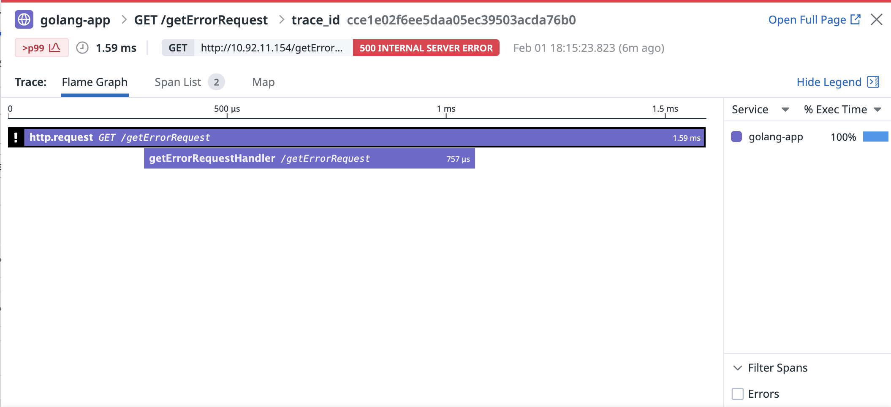

# Golang Example
- This shows a dummy application with Datadog Tracer implemented.
- gorillamux is used as the router > and this uses Datadog Automatic Instrumentation (https://pkg.go.dev/gopkg.in/DataDog/dd-trace-go.v1/contrib/gorilla/mux)
- getErrorRequest and api endpoints are custom instrumented using Datadog Custom Instrumentation
---
## Outcome

---
### Local Testing
- To test and visualize your implementation on Golang, you can use a docker-compose set up. 
- Replace the APIKEY with Datadog's API Key in the docker-compose.yaml
- To start containers
```
docker compose up -d --force-recreate --no-deps --build
```
