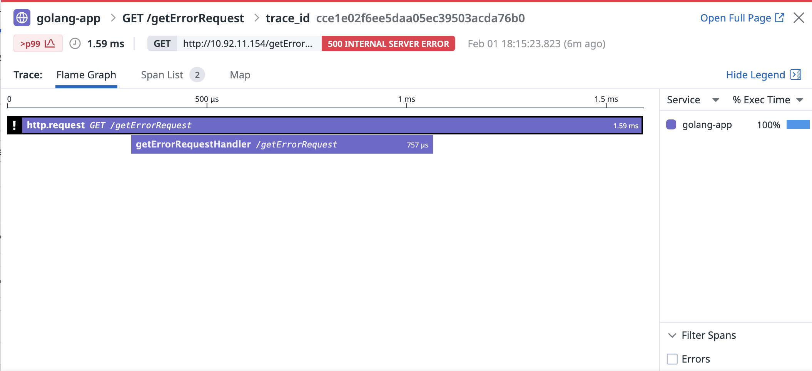

# Golang Example
- This shows a dummy application with Datadog Tracer implemented.
- gorillamux is used as the router > and this uses Datadog Automatic Instrumentation
- getErrorRequest and api endpoints are custom instrumented using Datadog Custom Instrum
---
## Outcome

